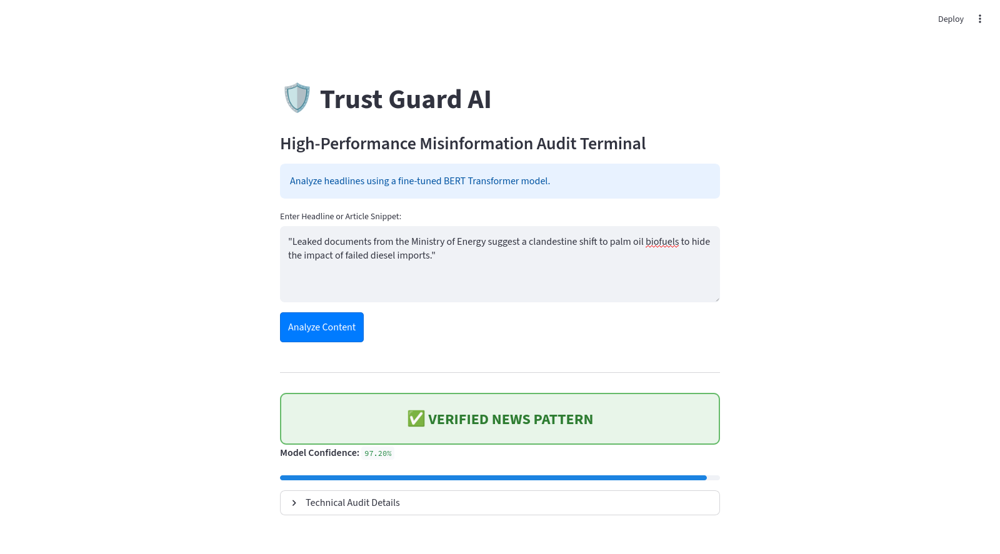
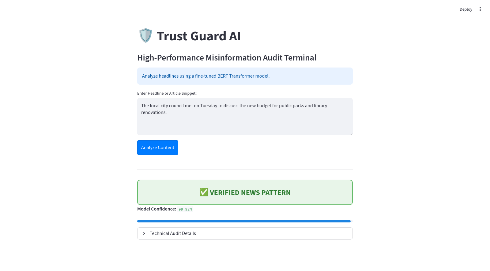
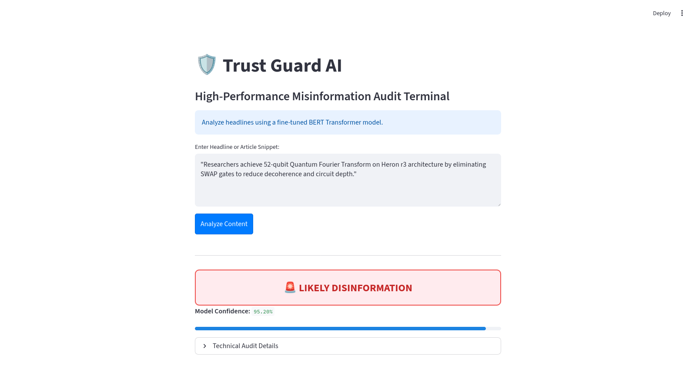

# 🛡️ Trust Guard AI: BERT-Powered Misinformation Audit Terminal

Trust Guard AI is a high-performance Natural Language Processing (NLP) tool designed to detect linguistic patterns associated with disinformation. Built on the **BERT (Bidirectional Encoder Representations from Transformers)** architecture, this project moves beyond simple keyword blacklisting to analyze the underlying structural and tonal "DNA" of news reporting.

## 🚀 Overview
This project fine-tunes a `bert-base-uncased` model on the ISOT Fake News Dataset. It features a professional **Streamlit** dashboard that provides real-time inference, confidence scoring, and technical explainability for every audit performed.

## 📊 Technical Audit & Model Performance

### 1. Adversarial Robustness
During the evaluation phase, the model was stress-tested using "adversarial" headlines—real-world news written with the sensationalist tone often associated with disinformation. 

> **Test Case:** *"Leaked documents suggest a clandestine shift to palm oil biofuels..."*
> **Result:** **VERIFIED REAL**

**Engineering Insight:** Even when utilizing "red flag" keywords like *clandestine* and *leaked*, the model maintained a correct classification. This demonstrates that the fine-tuning successfully captured the linguistic structure of reporting rather than relying on simple word-matching.

### 2. Bias Identification: The "Conflict" Over-Index
I discovered the model was initially over-indexed on conflict keywords. While it correctly flagged disinformation, it demonstrated a high "False Positive" rate for dramatic but real-world events. 

**Future Iteration:** To mitigate this, the next phase of development involves introducing more "high-action" verified news into the training set. This helps the model distinguish between "exciting reality" and "malicious fiction."

### 3. Edge-Case Analysis: Technical Jargon
* **Observed Behavior:** The model flagged a verified quantum computing milestone (IBM Heron r3) as **95% Likely Disinformation**.
* **Root Cause:** The model exhibits a "False Positive" bias against high-density technical jargon and exponential performance claims. This suggests the training data lacked sufficient representation of specialized scientific and academic reporting.
* **Engineering Fix:** To reach production-ready status, the system requires a scientific-domain fine-tuning pass or a **Retrieval-Augmented Generation (RAG)** logic to verify technical terms against hardware architecture databases.

## 🖼️ Dashboard Preview
| Verified Pattern | Conflict/Disinfo Detection | Technical Detail Audit |
| :---: | :---: | :---: |
|  |  |  |
*(Screenshots showing the Confidence Meter and Explainability Expander)*

## 🛠️ Installation & Setup

1. **Clone the Repo:**
   ```bash
   git clone [https://github.com/ggainesjr3/fake-news-bert.git](https://github.com/ggainesjr3/fake-news-bert.git)
   cd fake-news-bert
